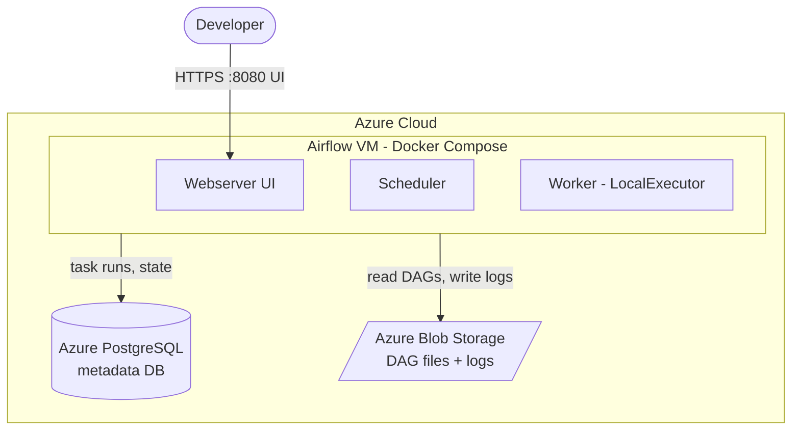

```mermaid
flowchart TB
    dev([Developer]) -->|HTTPS :8080 UI| web

    subgraph azure [Azure Cloud]
        subgraph vm [Airflow VM - Docker Compose]
            web[Webserver UI]
            sched[Scheduler]
            worker[Worker - LocalExecutor]
        end
        pg[(Azure PostgreSQL<br/>metadata DB)]
        blob[/Azure Blob Storage<br/>DAG files + logs/]
    end

    vm -->|task runs, state| pg
    vm -->|read DAGs, write logs| blob
```