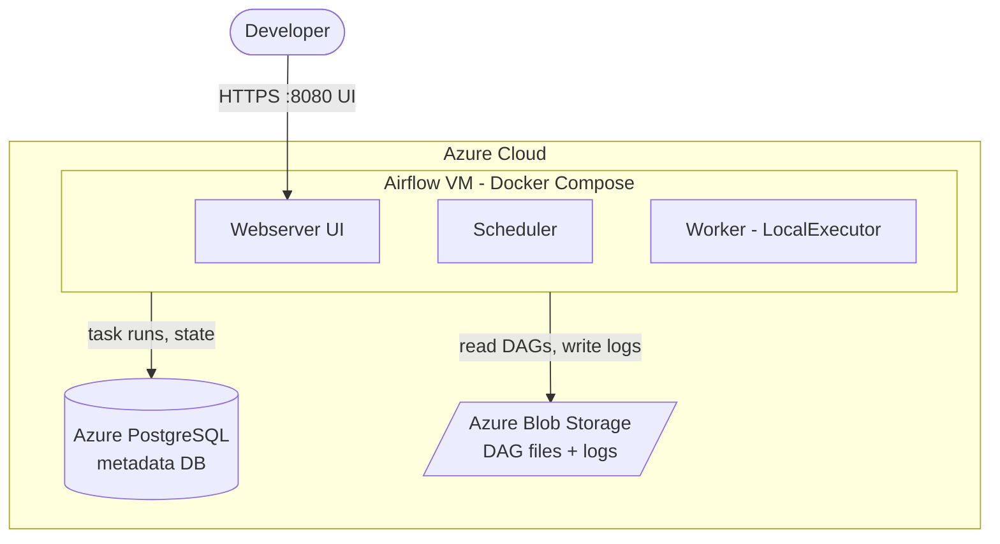

# zero_to_one_airflow

Airflow-based ETL demo: DAGs load an orders/customers/products schema into
Postgres via a couple of stored procedures.

For deploying the infrastructure see [DEPLOYMENT.md](DEPLOYMENT.md)

## Repo layout

```
src/dags/                    # Airflow DAG definitions
  test_job.py                 # simple tutorial DAG, runs tasks/test.py
  ddl_setup.py                 # one-off/manual DAG, creates tables + stored procedures
  data_proc.py                 # scheduled (*/5 * * * *) parent/child load

src/tasks/                   # scripts invoked by the DAGs via BashOperator
  create_ddl.py                 # runs createStatement.sql against POSTGRES_DATA_DB
  createStatement.sql            # DDL: customer/product/orders/order_items/order_details/monthly_summary
                                  # + load_order_details() and load_monthly_summary() stored procedures
  load_order_details.py          # CALL load_order_details()
  load_monthly_summary.py        # CALL load_monthly_summary()
  test.py                        # prints a timestamp, used by test_job

sample_data/insert.sql       # sample customer/product/orders/order_items rows for local testing

docker-compose.yml          # Airflow (webserver/scheduler/dag-processor), LocalExecutor
IAC/terraform/               # Terraform for the Azure infra, see DEPLOYMENT.md
.github/workflows/           # deploy-compose.yml, deploy-dags.yml (see DEPLOYMENT.md)
```

## Data model

`ddl_setup` creates the demo schema:

- `customer`, `product`, `orders`, `order_items` — source tables
- `order_details` — denormalized join of `orders` + `order_items`, rebuilt by `load_order_details()`
- `monthly_summary` — per-customer monthly sales total, rebuilt by `load_monthly_summary()` from `order_details`

`data_proc` runs both stored procedures in order (`load_order_details` → `load_monthly_summary`) every 5
minutes, demonstrating a parent/child load that avoids orphaned rows even when data arrives out of order.
Populate the source tables with [sample_data/insert.sql](sample_data/insert.sql) before running it.

### ER diagram


### Data pipeline flow


## DAGs

| DAG | Schedule | Purpose |
|-----|----------|---------|
| `test_job` | daily | Sanity-checks the deployment; prints a timestamp. |
| `ddl_setup` | manual | Creates the tables and stored procedures. Run once before `data_proc`. |
| `data_proc` | every 5 min | Loads `order_details` then `monthly_summary`. |

All three read Postgres credentials (`POSTGRES_HOST`, `POSTGRES_DATA_DB`, `POSTGRES_USER`,
`POSTGRES_PASSWORD`) from the environment — set in `docker-compose.yml`, populated in `.env` on the VM.

## Technical architecture



## Stack

- [Apache Airflow](https://airflow.apache.org/) 3.0.2, `LocalExecutor`, Docker Compose
- Azure PostgreSQL Flexible Server — one DB for Airflow metadata, one for the demo data
- Azure Blob Storage — DAG/task files and logs are synced to/from the VM (see `.github/workflows/deploy-dags.yml`)
